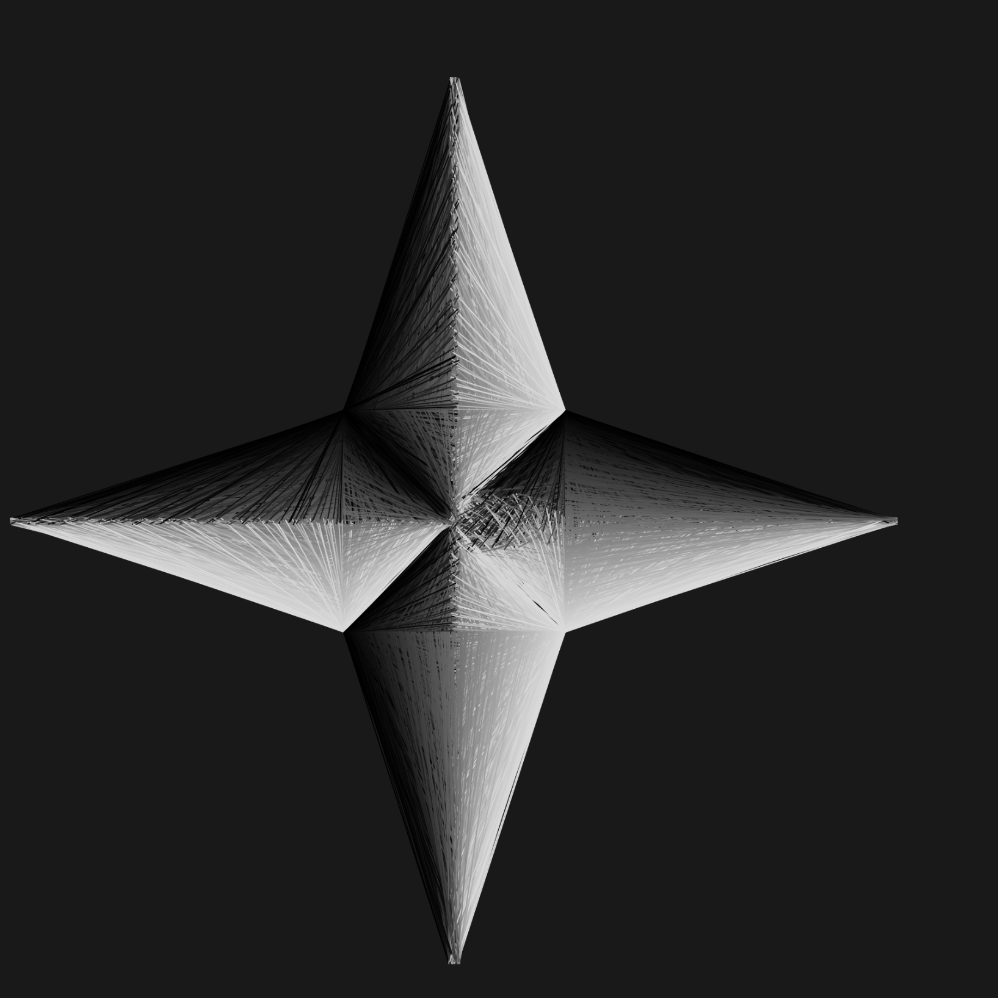

# Generative (programmed) sketches

Nowadays generative is a loaded word, but this has nothing to do with generative AI. That shit 
be banned from this REPO. 

### TODO

Figure out a better name for this pursuit as opposed to 'generative art.'

## This is a collection of generative art written in jscript. 

## To render an image, you open the index.html file with the desired script path designated as 'src'.

Lots of randomness is utilized, so everytime a script is rendered the resulting image 
**will be different!!**

Additionally, most of these are dynamic scripts with images that change as time elapses, in some case periodically. Rendering the index files in a browser is really the best way to experience
the pieces. Much is lost in the static images. 

## Sources:
Utilizing the p5$_*$js package:
https://p5js.org/
Check them out! 

## Concepts/inspo:
Natural landscapes and phenomena are a big inspiration. 
Been motivated on greyscale lineart because 
1) it's relatively straightforward to implement 
2) it's challenging to execute a concept with this limited setup and 
3) I like the 'x-ray' effect this gives and it's evocation of skeletal aesethic. 
Rocks are the bones of the earth after all.   

If you like anything, send a message! 

## Current Collections:

### Forest Thunderstorm:
Lots of trees, in a bunch, with lightning strikes in the sky illuminating the forest.
Every other frame count the thunderstorm script alternates between lightning and darkness,
so load it into a browser!

 

### trees:
Been wanting to apply the line art aesthetic common to these sketches to draw trees. The key 
ended up being using Catmull-Rom splines, a mathematical interpolation curve where one specifies
4 cartesian points ( in the 2D case ), the middle 2 lying on the curve and the 1st/4th being 
"control points" that speaking aesthetically determine the degree and nature of the curvature
of the spline. Here is a nice website where one can play with these splines:
https://www.desmos.com/calculator/552cpvzfxw
Additionally, a lot of randomness and some choices of how to scale various parameters were
used.

An example sketch:

### lightning:
Attempt to capture the drama of lightning bolts. Tricks were to use a lot of randomized direction
changes, segment length and quantity parameters. The jagged effect almost looks like a random walk.

Currently:

### Ships:
Early collection, focused on experiments with framerate and geometry shading. The somewhat 3D looking polygons look like some sort of spaceship perhaps - hence the name.

*With an attempt at a galaxy band in the background*:

### Stars
Some north star inspired images using the same straight line geometric style as for Ships. 

Example images:

Standard north star snapshot:

Fuzzed star with some noise softening the corner boundaries

Fuzzed star with bursting effect from lines originating at the center

LICENSE COVERING ALL SCRIPTS:
  
    Copyright (C) 2025  Dean J Katsaros

    This program is free software: you can redistribute it and/or modify
    it under the terms of the GNU General Public License as published by
    the Free Software Foundation, either version 3 of the License, or
    (at your option) any later version.

    This program is distributed in the hope that it will be useful,
    but WITHOUT ANY WARRANTY; without even the implied warranty of
    MERCHANTABILITY or FITNESS FOR A PARTICULAR PURPOSE.  See the
    GNU General Public License for more details.

    You should have received a copy of the GNU General Public License
    along with this program.  If not, see <https://www.gnu.org/licenses/>.
